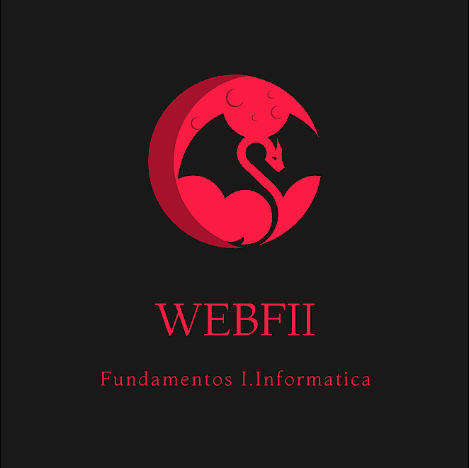

# Esta página está hecha por Dario Rodriguez Pajares
<!-- # Trabajo-Web-individual -->
## Descripción
Esta es la página web del trabajo individual de Fundamentos de Ingenieria Informática

Como apoyo para la creación, he utilizado el framework Bootstrap, es una gran opción para hacer un diseño atractivo en la etapa de desarrollo. Utilizando su versión 5.3
  - bootstrap: https://getbootstrap.com/ 

Aparte de utilizar esta librería he utilizado mi archivo CSS para poder implementar un fondo de pantalla animado que está presente en toda la web 

<!-- TODO poner foto de como recibo el correo electrónico 
 -->

 

  ## Páginas de la web 
  ### Estructura
  Podemos encontrar en la parte superior de la página un menú de navegación el cual indica en que parte de la página web te encuentras.

  Esta estructura de menú superior lo encontremos en todo el sitio web para mantener un mismo estilo y que la navegación sea más sencilla e intuitiva

  ### Index:
  Esta página consta de una pantalla de inicio en la cual da una introducción del sitio web. 
  En esta página podemos encontrar principalmente un texto que nos habla un poco del sitio web. 
  Algo más abajo encontraremos 2 botones que nos harán de acceso directo a otras partes de la página web.

  ### Contacto:
  En esta página tenemos un formulario el cual al rellenar y darle a enviar te pide que realices un captcha y manda los datos introducidos en el formulario al correo electrónico. 

  ### Redes:
  En la página de redes podemos ver el acceso a las páginas de algunos compañeros.

  ###  Temas:
  En la página de temas encontraremos algo de información sobre la Steam Deck aparte de un enlace a la página de Steam con más información. 

  ### Sobre mi
  En esta sección encontramos un pequeño texto descriptivo como encabezado de la página. 
Después encontramos una previsualización de mi CV el cual se puede descargar algo más abajo. 
También incluyo dos fotos mías con un pie de foto. 
Y accesos directos a Instagram, Twitter y TikTok. 

  ### Fundamentos
  En esta sección encontraremos al inicio un pequeño menú que nos permtirá navegar por la página de una forma más intuitiva.   
  Aparte están incluidos todos los temás del curso separados por bloques e indicando cada una de las unidades tratadas.  
  En la **unidad 3** tenemos una subpágina en la cual podemos observar una vista previa de la presentación del tema y un botón que nos permite descargarnos el PDF

## Problemas en el desarrollo 
  A la hora de importar la hoja de estilos de bootstrap y los iconos si ponía la de iconos debajo de la general de bootstrap los iconos no funcionaban, no entiendo por qué no funciona en el otro orden, pero lo solucione importando primero los iconos, luego mi CSS y después bootstrap

  Aparte en al hacer las páginas he tenido algún problema con el tamaño de la página, esta se hacia más ancha de lo que debía y aparecía una barra desplazadora que no me gustaba como quedaba asique tuve que volver a hacer parte de la página para que quedase bien ya que no encontraba cual era el fallo

## Conclusiones
En general ha quedado una página web que en mi opinión es muy bonita, minimalista pero útil.  
Finalmente he terminado refrescando la metodología del desarrollo web.

### Acceso a la página web: https://dariblue.github.io/Trabajo-Web-individual/